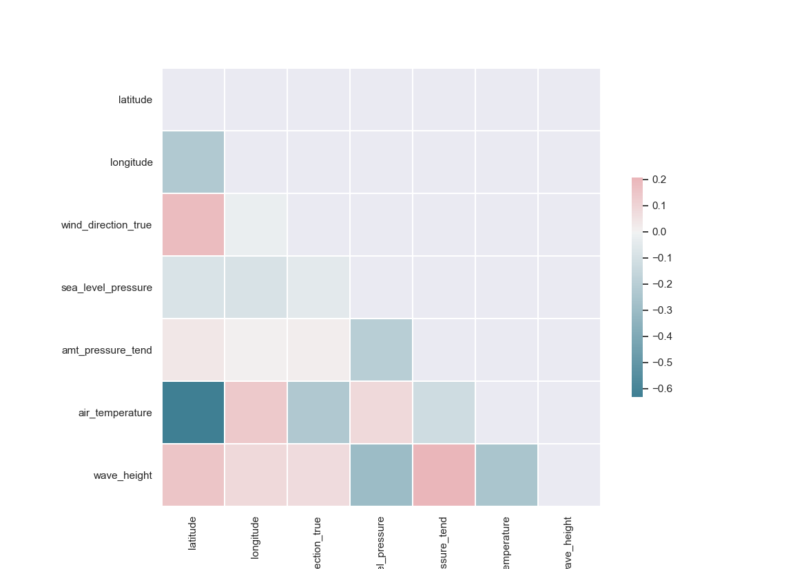
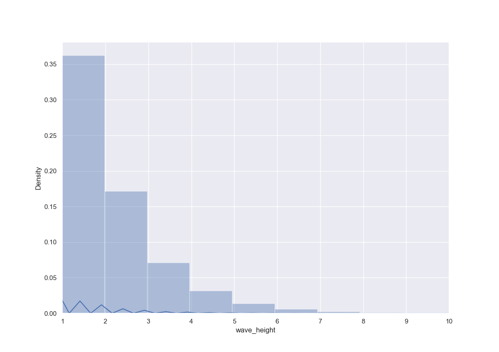

# Matias Gonzalez 
# Predicting The Best Time To Shoot Some Curls

---

## Table of Contents
1. [Project Goal](#Goal-of-the-Project)
2. [The Data](#the-data)
3. [Exploratory Data Analysis (EDA)](#exploratory-data-analysis-eda)
4. [Data Visualization](#data-visualization)
5. [Model](#Model)
6. [Conclusion](#conclusion)
7. [Future Research](#future-research)

## Goal of the Project

Have you ever been next to a beautiful beach but as soon as you take out your phone and you notice your subscription to Surfline has expired? How are you going to know when it's the best time to surf? The goal of this project is very simple, to predict at what time will waves be at their highest. We are going to be taking a look at an oceanic dataset to see if we can create a model capable of predicting wave height. 

## The Data
The most comprehensive dataset I could find was The International Comprehensive Ocean-Atmosphere Data Set or ICOADS (https://icoads.noaa.gov). This dataset contains global ocean marine meteorological and surface data. It is formed by merging many national and international data sources that contain measurements and visual observations from ships, buoys, coastal stations, and other platforms. This dataset is publicly available through Google's BigQuery API and was accessed using the Python client library. 

### Pulling and Proccesing the Data
After installing the required google BigQuery libraries, you can access this dataset by creating a project on the Cloud Console and adding the dataset to the project.  After connecting your bq command line to your project you can simply run SQL queries in conjunction with python code to pull in the data. The imported data comes in Google's proprietary Table object data type but can be transferred over to a Pandas data frame for ease of use. The dataset contains data from 1662 to 2017, so we decided to pull in the most recent 10 years to aid in data precision and cut the huge file size down to 60 GB. 

BigQuery limits your download to 1 GB or 16,000 rows so I had to use loops to download all of the data and then make individual CSV's of the downloaded section. I ended up creating around 550 individual CSV files for all of my data. Another loop was then implemented to pull in all of the individual CSV's and merge them into one Panda Dataframe. 

## Exploratory Data Analysis (EDA)

First, lets take a look at all of the featires and thier data types. 

| Feature Name              	| Data Type 	|
|---------------------------	|-----------	|
| year                      	| INT       	|
| month                     	| INT       	|
| day                       	| INT       	|
| hour                      	| FLOAT     	|
| latitude                  	| FLOAT     	|
| longitude                 	| FLOAT     	|
| imma_version              	| INT       	|
| attm_count                	| INT       	|
| time_indicator            	| INT       	|
| latlong_indicator         	| INT       	|
| ship_course               	| INT       	|
| ship_speed                	| INT       	|
| national_source_indicator 	| INT       	|
| id_indicator              	| INT       	|
| callsign                  	| STR       	|
| country_code              	| STR       	|
| wind_direction_indicator  	| INT       	|
| wind_direction_true       	| INT       	|
| wind_speed_indicator      	| INT       	|
| wind_speed                	| FLOAT     	|
| visibility_indicator      	| INT       	|
| visibility                	| INT       	|
| present_weather           	| INT       	|
| past_weather              	| INT       	|
| sea_level_pressure        	| FLOAT     	|
| characteristic_of_ppp     	| INT       	|
| amt_pressure_tend         	| FLOAT     	|
| wbt_indicator             	| INT       	|
| wetbulb_temp              	| FLOAT     	|
| dpt_indicator             	| INT       	|
| dewpoint_temp             	| FLOAT     	|
| sst_measurement_method    	| INT       	|
| sea_surface_temp          	| FLOAT     	|
| total_cloud_amount        	| INT       	|
| lower_cloud_amount        	| INT       	|
| lower_cloud_type          	| STR       	|
| cloud_height_indicator    	| INT       	|
| cloud_height              	| STR       	|
| middle_cloud_type         	| STR       	|
| high_cloud_type           	| STR       	|
| wave_direction            	| INT       	|
| wave_period               	| INT       	|
| wave_height               	| FLOAT     	|
| swell_direction           	| INT       	|
| swell_period              	| INT       	|
| swell_height              	| FLOAT     	|
| box_system_indicator      	| STR       	|
| ten_degree_box_number     	| INT       	|
| one_degree_box_number     	| INT       	|
| deck                      	| INT       	|
| source_id                 	| INT       	|
| platform_type             	| INT       	|
| dup_status                	| INT       	|
| dup_check                 	| INT       	|
| track_check               	| INT       	|
| pressure_bias             	| INT       	|
| wave_period_indicator     	| INT       	|
| swell_period_indicator    	| INT       	|
| second_country_code       	| INT       	|
| adaptive_qc_flags         	| STR       	|
| nightday_flag             	| INT       	|
| trimming_flags            	| STR       	|
| ncdc_qc_flags             	| STR       	|
| external                  	| INT       	|
| landlocked_flag           	| INT       	|
| source_exclusion_flags    	| INT       	|
| unique_report_id          	| STR       	|
| release_no_primary        	| INT       	|
| release_no_secondary      	| INT       	|
| release_no_tertiary       	| INT       	|
| intermediate_reject_flag  	| INT       	|
| timestamp                 	| OBJ       	|

The dataset contains 75 individual features and has close to a billion entries. This is a huge dataset that is feature-heavy and has a lot of data points. To simplify the project and make it feasible to run on a commmon machine we had to cut the dataset by a great amount. My next idea was to look at the NaN's since maybe dropping those could provide a workable dataset. This is what some key feature percent of NaN's per columns looks like. 

| Feature Name        	| % NaN's per column 	|
|---------------------	|--------------------	|
| latitude            	| 0                  	|
| longitude           	| 0                  	|
| sea_surface_temp    	| 39.6               	|
| country_code        	| 93.7               	|
| wind_speed          	| 95.9               	|
| wind_direction_true 	| 0                  	|
| amt_pressure_tend   	| 74.1               	|
| air_temp            	| 5.5                	|
| sea_level_pressure  	| 7.3                	|
| wave_direcion       	| 100                	|
| wave_height         	| 89.9               	|
| wave_speed          	| 97.5               	|
| swell_height        	| 98.8               	|
| swell_speed         	| 100                	|
| timestamp           	| 0                  	|

After taking a look at the NaN's my biggest or major observations were:

    1. I will be favoring using latitude and longitude over country code since it complete
    2. I will have to drop wind_speed, swell_height, wave_direction and swell_speed, from the data, since there are way too many NaNs meaning it is mostly incomplete or not precise data	
    3. I can ignore the other date columns and only use the timestamp 
    4. Since I am trying to predict wave_height this will be the biggest contributor to row dropping. 

After dropping all of the unnecessary columns and limiting our row numbers based on dropping all the NaNs we have a workable dataset. I decided to export this final data frame to individual CSV's per year for ease of running and testing. 

## Data Visualization

Let's move on to some data visualization so we can take a closer look at the data we are working with. First, lets look at the correlation between variables by using a correlation matrix

As we cann se from out correlation  amtrix our variables are correlated but the streanght is not too high. The only two variables that have a high positive corrlation of aournd .60 are aire temperature and latitude. this makes snese since the further away you are from the equator the more extreme temperatures get. 

Since the main goal of our project was to determine wave height I graphed a distribution plot of the wave heights found in our data.

The graph is very left-skewed, meaning the distribution of our waves is mostly toward the smaller side. After closer inspection, I can see that a little above 35% of our waves are less than 1 meter, and around 17% are around 2 meters. This means that our target of big waves is the minority of the distribution making this even harder. 

To finish it off I decided to plot a scatter plot with wave_height and air_tempetaure to visualize their relationship. 

## Model
I was very determined to use a neural network to make my predictions due to the sheer amount of data I was working with. I decided to use a sequential model with the basic 3 layers. Unfortunately due to time constraints I only had time for one model run with my complete sataset which took a whopping 8 hours to run. This means I had no time to tune my model or try to make any adjustments to it.

Since my data is time-based we had to apply a time series train test split in order to respect time. this was done easily since we had a timestamp column. My model was not the best at predicting when the best surf time is going to be. I used kfold and mean squared error as a means of cross-validation. I got a score of 0.185, which s pretty high. this means our model is usaully around 18.5 percent incorrect.  

I had a pretty low dropout rate for regularization which could have been tuned higher in order to account for specialization. In general, I would have liked a bit more time in order to work more on the model and get a better result from it. It was pretty hard to work on something that took 8 hours to run when the project had a one-week time constraint. 

## Conclusion
One major stepback in this project was the amount of error present in the dataset. Upon further inspection, it seems that all of the indicators for accuracy have very high numbers meaning our data is not that accurate. Looking back at my steps I would have liked ot keep the wind_speed column. Even though we were going to lose a lot of data we had enough data to simply drop around 96 percent of it. It would have probably been beneficial to the project as a whole as it would have probably diminished our run times. 

## Notes
My biggest note is Chris suggested I change datasets and I should have listened, this was very difficult to work with due to its sheer size and our time limitation when running it.
Look into monte Carlo augmentation in order to work with wind_speed.
